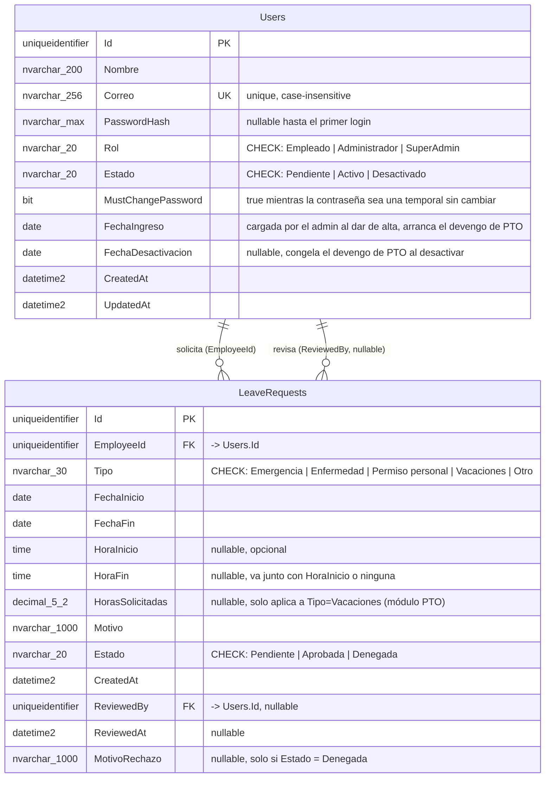

# Diagrama ER — OwnSpaceAPI

Ver `../SPEC.md` sección 8 para el contexto. Los nombres de columna en español reflejan el dominio de negocio, igual que `src/contracts/interfaces/` del frontend.

## Notas de diseño

- **Sin tabla de sesiones**: la autenticación es JWT stateless en cookie httpOnly (ver `SPEC.md` §9) — no hay estado de sesión que persistir en la base. El logout es del lado del cliente (ver Open Questions en `SPEC.md`).
- **Sin tabla de tokens de reset**: "olvidé mi contraseña", la invitación al crear un usuario, y el reset por un admin (`users.api.ts#create` / `#resetPassword`) comparten el mismo mecanismo — generan una contraseña temporal, la escriben directo en `Users.PasswordHash` y la envían por correo, en vez de un token de un solo uso aparte. `Users.MustChangePassword` marca que esa contraseña sigue siendo la temporal; el backend (middleware en `Program.cs`) bloquea el resto de `/api` mientras esté en `true`, hasta que el usuario la cambie por `POST /auth/change-password`.
- **`Rol`/`Estado` como `nvarchar` + `CHECK`, no tablas de lookup separadas**: son enums cerrados y pequeños (3 y 3 valores respectivamente), no van a crecer dinámicamente ni necesitan metadata propia — una tabla de lookup sería una abstracción sin uso real. Mapean 1:1 a un `enum` de C# en el código.
- **`Id` como `uniqueidentifier` (GUID)** en vez de `int IDENTITY`: los ids aparecen en URLs (`/users/{id}`, `/requests/{id}`) — un GUID no es adivinable/enumerable como un entero secuencial.
- **Índice único case-insensitive en `Users.Correo`**: SQL Server usa collation case-insensitive por defecto (`..._CI_AS`), así que un `UNIQUE INDEX` estándar ya replica la comparación case-insensitive que hoy hace el mock (`mockUsersAdapter.create`/`update`) al chequear duplicados — confirmar que la collation de la base efectivamente sea `_CI_` al crearla.
- **Sin tabla ni ledger de balance de PTO**: el devengo (5h por quincena) y el reinicio anual ("use it or lose it") se calculan al vuelo en cada `GET /pto/balance` a partir de `Users.FechaIngreso`/`FechaDesactivacion` y de la suma de `LeaveRequests.HorasSolicitadas` ya `Aprobada` del año en curso — ver `Services/Pto/PtoBalanceCalculator.cs`. No hay ningún job/cron: el recorte al 1-enero y el congelamiento en `FechaDesactivacion` ya lo resuelve la fórmula sola.
- **`Vacaciones` vía `/pto/requests` es autoservicio, no pasa por aprobación**: a diferencia de los otros 4 tipos de `LeaveRequests` (que nacen `Pendiente` y requieren `/requests/{id}/approve|deny`), una reserva de PTO nace directo en `Aprobada`, sin `ReviewedBy`/`ReviewedAt` — nadie la revisó. `HorasSolicitadas` solo tiene valor para estas filas.
