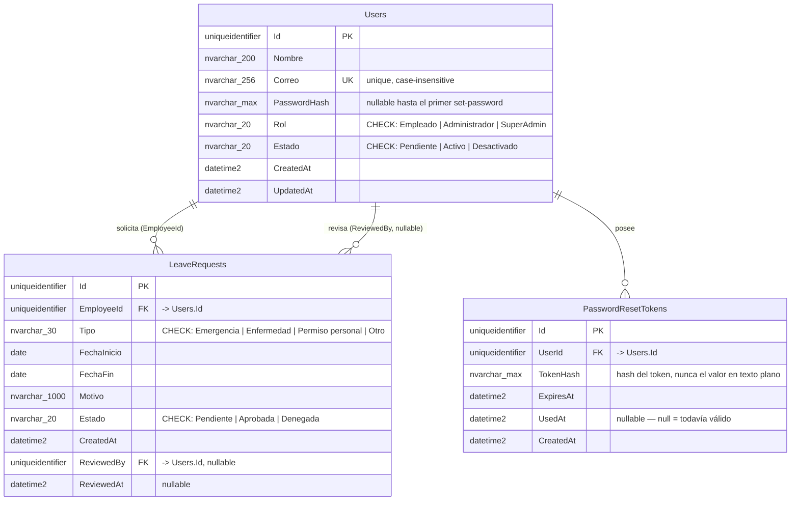

# Diagrama ER — OwnSpaceAPI

Ver `../SPEC.md` sección 8 para el contexto. Los nombres de columna en español reflejan el dominio de negocio, igual que `src/contracts/interfaces/` del frontend.

## Notas de diseño

- **Sin tabla de sesiones**: la autenticación es JWT stateless en cookie httpOnly (ver `SPEC.md` §9) — no hay estado de sesión que persistir en la base. El logout es del lado del cliente (ver Open Questions en `SPEC.md`).
- **`PasswordResetTokens` sirve dos flujos**: "olvidé mi contraseña" (`forgot-password`) e "invitación a definir contraseña" al crear un usuario o resetear su contraseña desde el panel de admin (`users.api.ts#create` / `#resetPassword`) — mismo mecanismo, no se necesitan tablas separadas.
- **`Rol`/`Estado` como `nvarchar` + `CHECK`, no tablas de lookup separadas**: son enums cerrados y pequeños (3 y 3 valores respectivamente), no van a crecer dinámicamente ni necesitan metadata propia — una tabla de lookup sería una abstracción sin uso real. Mapean 1:1 a un `enum` de C# en el código.
- **`Id` como `uniqueidentifier` (GUID)** en vez de `int IDENTITY`: los ids aparecen en URLs (`/users/{id}`, `/requests/{id}`) y en el token de `PasswordResetTokens` — un GUID no es adivinable/enumerable como un entero secuencial.
- **Índice único case-insensitive en `Users.Correo`**: SQL Server usa collation case-insensitive por defecto (`..._CI_AS`), así que un `UNIQUE INDEX` estándar ya replica la comparación case-insensitive que hoy hace el mock (`mockUsersAdapter.create`/`update`) al chequear duplicados — confirmar que la collation de la base efectivamente sea `_CI_` al crearla.
